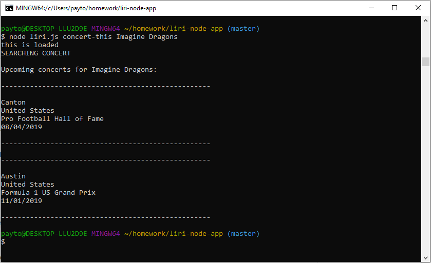
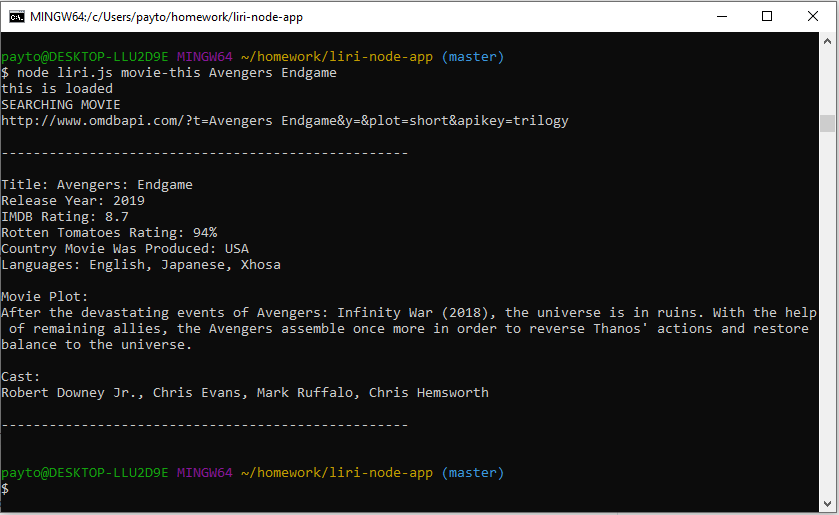
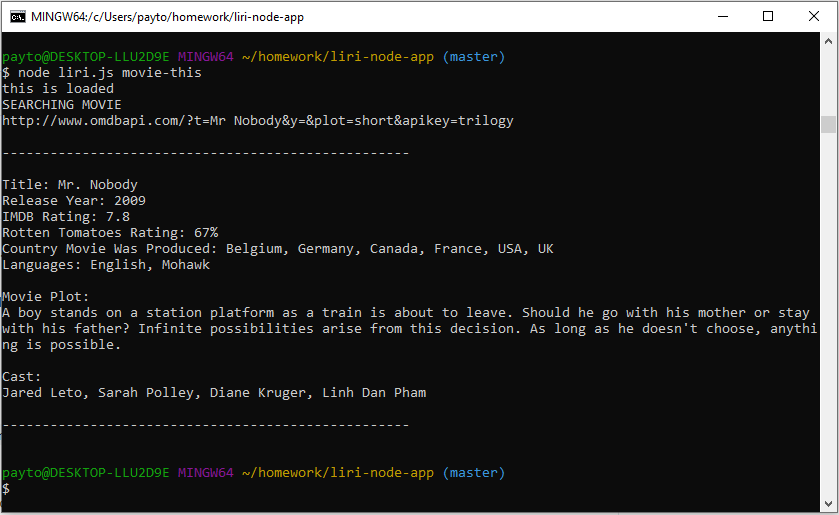
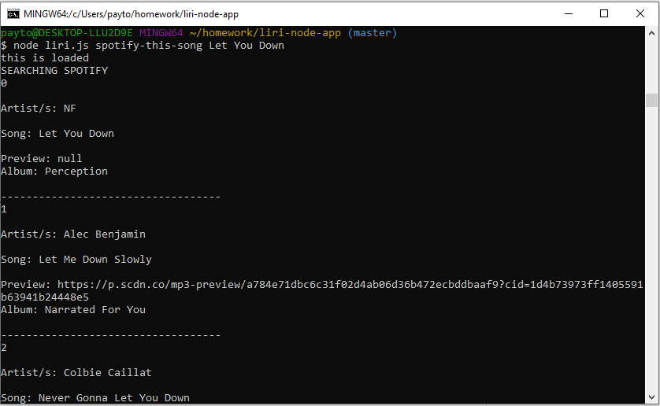
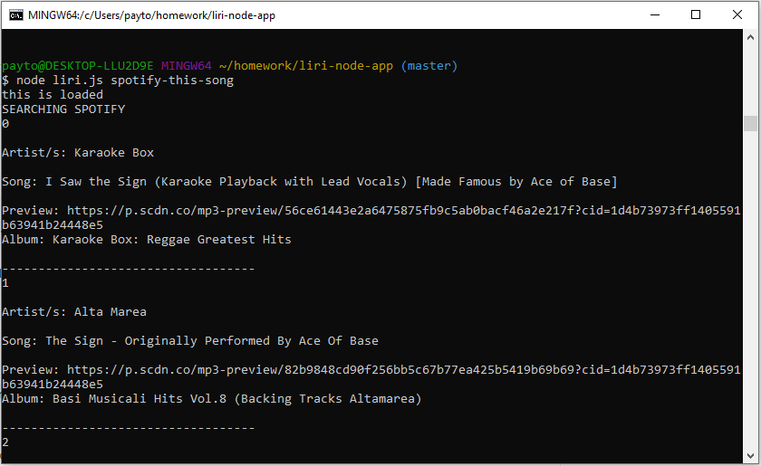
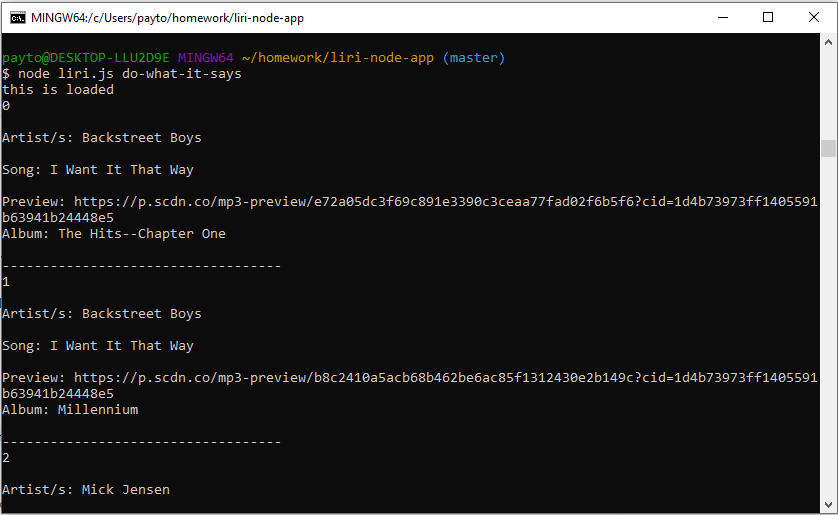

# liri-node-app

### Quickly search any movie, concert, or song track

##### This was made using several npm packages and constructors to dynamically generate information about the subjects above

* There are 4 commands:
   * concert-this `artist`
   * movie-this `movie name`
   * spotify-this-song `song artist / name`
   * do-what-it-says
   
* Running concert-this `artist` will search for the concert specified and print the venue information

* Running movie-this `movie name` will print the information about the movie such as Imdb/Rotten Tomato ratings, plot, actors, etc...
  * If no movie was specified, it will search for Mr. Nobody by default

* Running spotify-this-song `song artist / name` will print a list of tracks containing information about the artist/s, song name, song preview, etc...
  * If no song/artist was specified, it will search for "The Sign" by Ace of Base

* Running `do-what-it-says` will read the random.txt file and execute `spotify-this-song` based on what random.txt contains

## Preview

### `concert-this`:

### `movie-this`:

### `movie-this` With no movie specified:

### `spotify-this-song`:

### `spotify-this-song` With no song/artist specified:

### random.txt Preview:

### `do-what-it-says`

